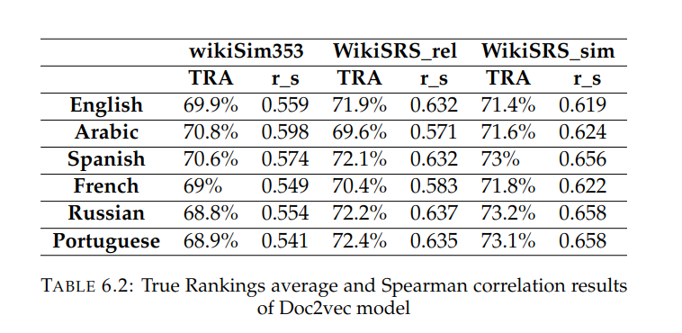
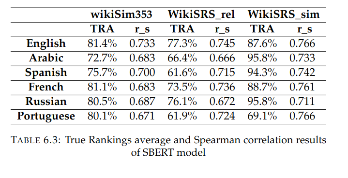

# WikiSRS dataset 

This dataset contains three dataset : 

1. [WikipediaSimilarity353 Test Collection](http://community.nzdl.org/wikipediaSimilarity/)
2. [WikiSRS_similarity](https://github.com/OSU-slatelab/WikiSRS/blob/master/dataset/WikiSRS_similarity.csv)
3. [WikiSRS_relatedness](https://github.com/OSU-slatelab/WikiSRS/blob/master/dataset/WikiSRS_relatedness.csv) 

These datasets mainly contain a relatedness score of two entities in english only. Also, it is given the wikipedia page id for each entity, and a multilingual wikipedia pages can be extracted by running (Extract_multilingual_wikipedia_pages.ipynb) notebook. The multilingual dataset will be saved in data file.

The results of Doce2Vec and SBERT models can be reproduced by running the main file, results are also saved in results folder. 

To run the main file with docker : 

`docker run --rm -it --init --gpus=all --ipc=host --volume="$PWD:/app" --workdir="/app" dr_dockerfile python3 WikiSRS_main.py `

## Results  

The results of Doc2vec and SBERT models for each language on each dataset are shown below : 

    

    

