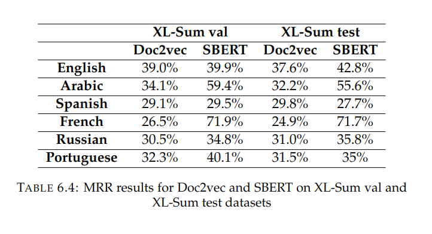

# XL-Sum dataset 

The source of this dataset is [this git repo](https://github.com/csebuetnlp/xl-sum). It is a very large multilingual text summarization dataset, about 1.35 million article-summary pairs. Since this dataset is very alarge, it can't ne uploaded to github. So, first run (Download_XL_Sum_dataset.ipynb) notebook to download the dataset in languages that we are interested in ('arabic','english','french','spanish', 'russian', 'portuguese'). Three files are going to be download, train/val/test files. 

After downloading the dataset, you can run the XLSum_main.py file to get the results of Doc2vec and SBERT models. The results alse will be saved in results folder. 

To run the main file with docker : 

`docker run --rm -it --init --gpus=all --ipc=host --volume="$PWD:/app" --workdir="/app" dr_dockerfile python3 XLSum_main.py `

## Results  

This table shows MRR results of Doc2vec and SBERT models for each language on val and test files : 

    

